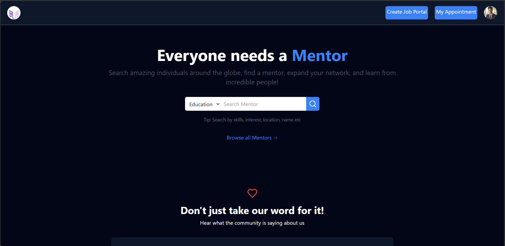
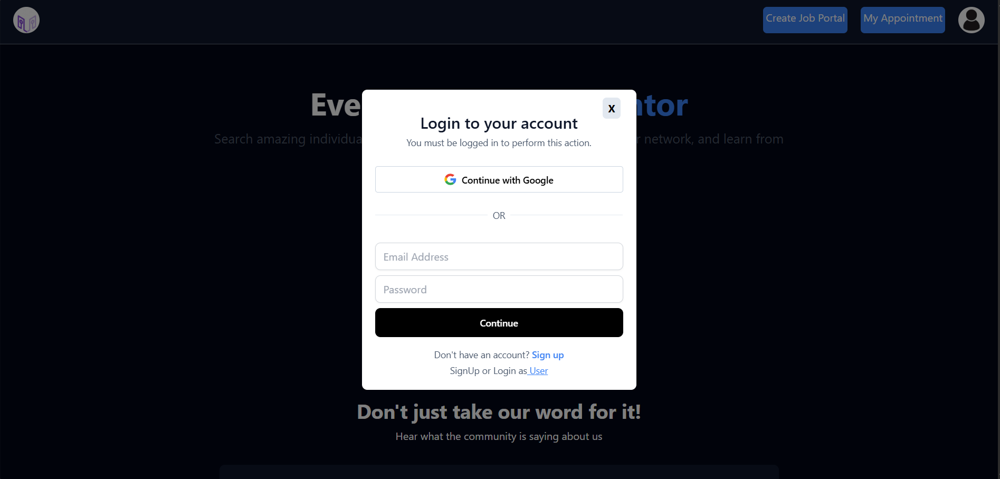
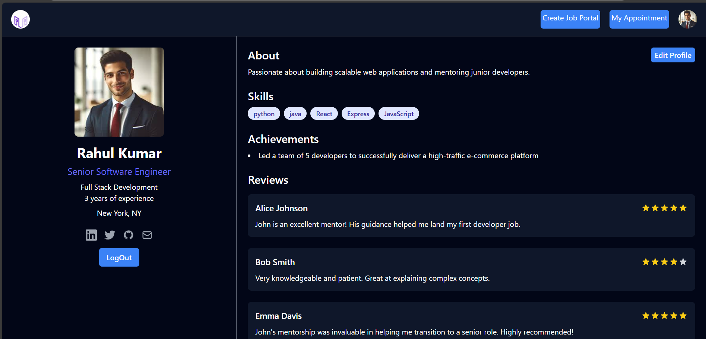
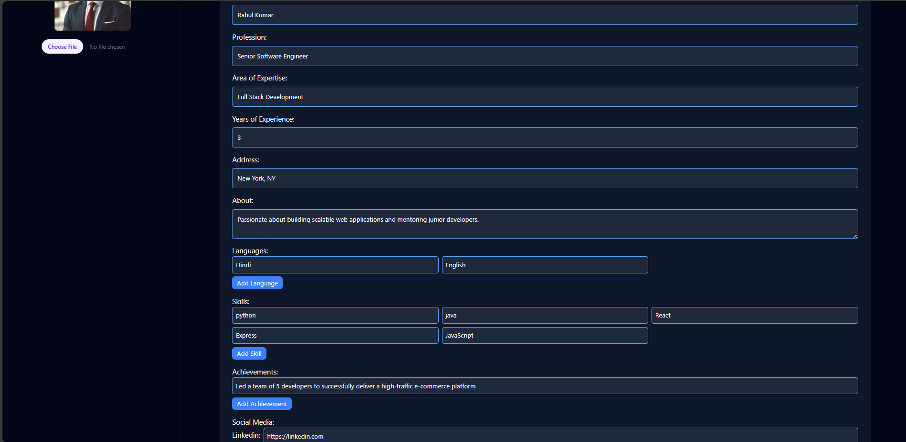
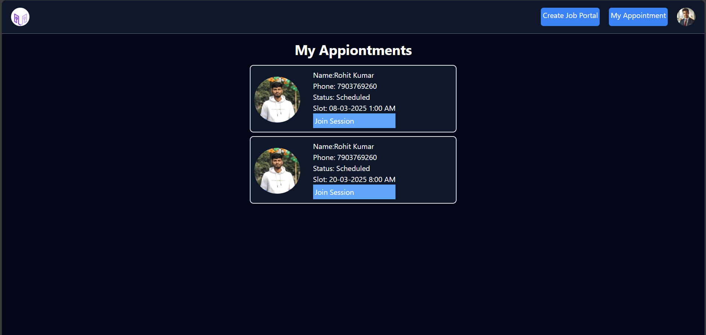

---

# 💼 UR-SARTHI — Full Stack Mentorship Platform

**UR-SARTHI** is a scalable and modern full-stack mentorship platform that connects mentees (students or professionals) with experienced mentors across various domains. The platform is designed to make mentorship accessible, structured, and convenient for all users. Mentees can sign up using OTP-based authentication, build their profiles with personal and educational details, explore mentor profiles based on expertise and availability, and book appointments for personalized one-on-one sessions. Additional features like free resources, job listings, appointment management, and secure payments using Razorpay are also integrated to enhance the user experience.

On the **mentor side**, professionals can register and create detailed public profiles showcasing their skills, languages, achievements, and availability schedule. Mentors can manage incoming appointment requests, accept or reject them, and even conduct sessions through a built-in video calling feature. The mentor dashboard provides clear visibility into upcoming sessions and previous interactions, making it easier to track and engage with mentees effectively.

Technically, the frontend is divided into two separate React.js applications—one for mentees and one for mentors—each styled using Tailwind CSS and managed using React Context API. The backend is built with **Node.js**, **Express.js**, and **MongoDB**, offering robust functionality for OTP authentication, user roles, appointment scheduling, payment handling, and image uploads via Cloudinary. Axios handles API communication across the apps, and role-based access is secured with JWT and middleware.

This project is ideal for educational communities, institutions, or startups looking to implement a mentorship-based solution. The architecture supports modular scaling and can easily integrate additional features like chat, email notifications, or analytics. Contributions and feedback are welcome!

---

## 📦 Repositories

- 🔗 **User (Mentee) Frontend:** [GitHub Link](https://github.com/kumarrohit2002/UR_Sarthi-User)
- 🔗 **Mentor Frontend:** [GitHub Link](https://github.com/kumarrohit2002/UR_Sarthi-Mentor)
- 🔗 **Backend (API Server):** [GitHub Link](https://github.com/kumarrohit2002/UR_Shathi_BE)

---

## 🧑‍🏫 PART 2: MENTOR MODULE

### 🧪 Sample Mentor Workflow

1. **Signup/Login**
   Mentors create an account by signing up or logging in. They verify their email before they can access the mentor dashboard.

2. **Profile Creation**
   Mentors fill out detailed profiles, including their expertise, skills, years of experience, and achievements. They also add their availability schedule for mentees to book sessions.

3. **Manage Profile**
   Mentors can update their profile at any time, adding or modifying their expertise, skills, or availability.

4. **View Booked Appointments**
   Mentors can see a list of upcoming appointments and accept or reject booking requests from mentees. They can track previous appointments and feedback from mentees.

5. **Session Conducting**
   When a mentee joins, mentors conduct live video sessions directly on the platform using the Room feature. Mentors can engage with mentees through interactive discussions, presentations, and Q&A.

6. **Session Feedback**
   After each session, mentors can view ratings and reviews left by mentees, which helps build their profile credibility. This feedback plays a crucial role in improving mentoring strategies and approaches.

7. **Job Listings**
   Mentors can post job listings for companies or startups that are hiring. These jobs are visible to mentees who may be interested in employment opportunities.

8. **Razorpay Payments**
   Mentors can set up payment requests for paid sessions, allowing mentees to pay through Razorpay. The platform ensures mentors receive timely payments for their sessions.

---

### 📂 Folder Structure (Relevant for Mentors)

```
src/
├── pages/
│   ├── EditMentorProfile.jsx
│   ├── MentorHomePage.jsx
│   ├── MentorProfile.jsx
│   ├── MyAppointment.jsx
│   └── Room.jsx  # for video call
├── components/
│   ├── CreateJob.jsx
│   ├── LoginSigup.jsx
│   ├── Navbar.jsx
│   ├── OtpInput.jsx
│   ├── MentorLandingPage.jsx
│   ├── MyAppointmentCard.jsx
│   ├── FAQSection.jsx
│   └── TestimonialPage.jsx
├── components/
│   ├── AppointmentContext.jsx
│   ├── AuthContext.jsx
│   └── MentorProfileContext.jsx
```

---

### ✨ Features for Mentors

- **Main page**  
  

- 🔐 **Mentor Signup/Login Page**  
  
  
- 👤 **Create & Update Detailed Mentor Profile**  
  

- 🛠 **Add Expertise, Skills, Achievements, and Availability**  
  

- 📆 **View and Manage Booked Appointments**  
  

---

### 🔧 Tech Stack

- **Frontend**: React.js
- **Styling**: Tailwind CSS
- **Routing**: React Router
- **API Calls**: Axios
- **State Management**: React Context API
- **Payments**: Razorpay Integration
- **Notifications**: React Toastify

---

### 🚀 Getting Started

1. **Clone the Repository**
   ```bash
   git clone https://github.com/your-username/ursarathi-frontend.git
   cd ursarathi-frontend
   ```

2. **Install Dependencies**
   ```bash
   npm install
   ```

3. **Create `.env` File**
   ```env
   REACT_APP_API_BASE_URL=http://localhost:4000/api/v1
   REACT_APP_RAZORPAY_KEY=your_razorpay_key
   ```

4. **Run the App**
   ```bash
   npm run dev
   ```

5. Visit: `http://localhost:3000`

---

## 🤝 Contributing

We welcome contributions for UI improvements, bug fixes, or new features. Just fork the repo, make your changes, and submit a pull request.

---

## 📜 License

This project is licensed under the [MIT License](LICENSE)

---

## 🙌 Special Thanks

Thanks to all mentors and mentees for being a part of the UR-SARTHI community and making knowledge sharing accessible!

---
